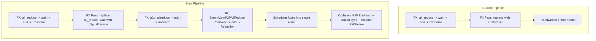

# Inductor-Generated Fused AllReduce via Kraken PTX

## Problem

Currently, the fused allreduce+RMSNorm kernel is handwritten in `[torch/distributed/_symmetric_memory/_fused_allreduce_rmsnorm_triton.py](torch/distributed/_symmetric_memory/_fused_allreduce_rmsnorm_triton.py)`. The FX pass in `[torch/_inductor/fx_passes/fused_allreduce_rmsnorm.py](torch/_inductor/fx_passes/fused_allreduce_rmsnorm.py)` replaces the pattern with a call to this handwritten kernel via a custom op. This limits flexibility -- any change to the compute (different fusion, different norm, different dtype) requires rewriting the kernel.

Inductor already generates excellent RMSNorm Triton kernels via its standard Pointwise+Reduction fusion. The goal is to inject the allreduce communication (P2P loads + kraken device-side sync) into the inductor-generated kernel, not replace the kernel entirely.

## Architecture




The key insight: the P2P allreduce is **pointwise** in element space (each output element = sum of that element across ranks). Inductor's scheduler will naturally fuse this Pointwise with downstream ops (add, pow, mean, rsqrt, mul) into a single kernel. Only the "load" step changes -- instead of `tl.load(buf + offset)`, we emit `sum(tl.load(peer_buf[i] + offset) for i in range(world_size))`.

## Generated Kernel Structure

The inductor-generated Triton kernel will look like:

```python
@triton.jit
def triton_red_fused_kernel(
    in_ptr0,           # original input (pre-allreduce)
    in_ptr1,           # weight
    in_ptr2,           # residual (optional)
    out_ptr0,          # normed output
    out_ptr1,          # pre_norm output (optional)
    symm_buf_ptr,      # local rank's symm mem buffer
    peer_buf_ptrs,     # all peer buffer pointers (tl.tensor of uint64)
    signal_pad_ptrs,   # signal pad pointers (tl.tensor of uint64)
    xnumel, rnumel,
    rank: tl.constexpr,
    WORLD_SIZE: tl.constexpr,
    XBLOCK: tl.constexpr,
    RBLOCK: tl.constexpr,
):
    # === Prologue: copy local input to symm mem ===
    # (generated by codegen when kernel has P2P loads)
    xoffset = tl.program_id(0) * XBLOCK
    # ... copy in_ptr0[row] -> symm_buf_ptr[row] ...

    # === Device-side sync (kraken PTX) ===
    ptx_utils.symm_mem_sync(signal_pad_ptrs, None, rank, WORLD_SIZE,
                            hasPreviousMemAccess=True, hasSubsequentMemAccess=True)

    # === P2P reduce load (replaces standard tl.load) ===
    # tmp0 = sum over all ranks of tl.load(peer_buf[i] + offset)
    # ... inductor generates this via ops.symm_mem_p2p_reduce_load() ...

    # === Standard inductor-generated RMSNorm compute ===
    # ... add residual, pow, mean, rsqrt, mul weight ...
    # (this code is IDENTICAL to what inductor generates for standalone RMSNorm)

    # === Epilogue: device-side sync ===
    ptx_utils.symm_mem_sync(signal_pad_ptrs, None, rank, WORLD_SIZE,
                            hasPreviousMemAccess=True)
```

## Implementation Components

### 1. New ops handler: `symm_mem_p2p_reduce_load`

**File**: `[torch/_inductor/ops_handler.py](torch/_inductor/ops_handler.py)`

Add a new method to `OpsHandler`:

```python
def symm_mem_p2p_reduce_load(
    self, name: str, index: sympy.Expr, world_size: int
) -> T:
    """Load from all peer symmetric memory buffers and reduce (sum)."""
    raise NotImplementedError
```

This follows the same pattern as `ops.load()` but signals to the codegen that this load should be a P2P reduce across `world_size` peer buffers.

### 2. Triton codegen for `symm_mem_p2p_reduce_load`

**File**: `[torch/_inductor/codegen/triton.py](torch/_inductor/codegen/triton.py)`

Add `TritonKernel.symm_mem_p2p_reduce_load()`:

- Register peer buffer pointers and signal pad pointers as kernel arguments
- Generate the P2P load + sum loop using `tl.static_range(WORLD_SIZE)`
- Mark the kernel as "has_symm_mem_p2p" so prologue/epilogue sync is emitted

Modify `TritonKernel.codegen_kernel()`:

- When `has_symm_mem_p2p`, add kraken `ptx_utils` import (`from kraken._ptx_utils import symm_mem_barrier as ptx_utils`)
- Emit copy-to-symm-mem + `ptx_utils.symm_mem_sync(...)` in the prologue
- Emit final `ptx_utils.symm_mem_sync(...)` after all stores
- Add `rank` and `WORLD_SIZE` as `tl.constexpr` kernel args

### 3. IR node: `SymmMemP2PAllReduce`

**File**: `[torch/_inductor/ir.py](torch/_inductor/ir.py)`

New class extending `Buffer` or creating a `Pointwise` with custom loader:

```python
class SymmMemP2PAllReduce:
    """IR node: load from all peer symmetric memory buffers and sum."""
    
    @staticmethod
    def create(input_buffer, world_size, group_name, reduce_op="sum"):
        # Creates a Pointwise whose inner_fn calls ops.symm_mem_p2p_reduce_load
        def inner_fn(index):
            return ops.symm_mem_p2p_reduce_load(input_name, indexer(index), world_size)
        return Pointwise.create(device=..., dtype=torch.float32, inner_fn=inner_fn, ranges=...)
```

The resulting `Pointwise` is fusible by the scheduler with downstream ops (RMSNorm chain).

### 4. FX pass modification

**File**: `[torch/_inductor/fx_passes/fused_allreduce_rmsnorm.py](torch/_inductor/fx_passes/fused_allreduce_rmsnorm.py)`

Simplify the pass -- instead of matching the FULL `all_reduce + add + rmsnorm` pattern and replacing with a custom op, just:

1. Match `all_reduce -> wait_tensor` where downstream consumers are fusible
2. Replace with `symm_mem.p2p_allreduce(input, reduce_op, group_name)`
3. Leave the RMSNorm decomposition and residual add **untouched** -- inductor fuses them naturally

This is simpler than the current pass and more general (works for any pattern after the allreduce, not just RMSNorm).

### 5. New custom op + lowering

**Custom op** (in `[torch/distributed/_symmetric_memory/](torch/distributed/_symmetric_memory/)`):

```python
@torch.library.custom_op("symm_mem::p2p_allreduce", mutates_args=())
def p2p_allreduce(input: Tensor, reduce_op: str, group_name: str) -> Tensor:
    """P2P allreduce designed to be fused into consumer kernels by inductor."""
    # Fallback: regular all_reduce + wait
    return funcol.all_reduce(input, reduce_op, group_name)
```

**Lowering** (in `[torch/_inductor/comm_lowering.py](torch/_inductor/comm_lowering.py)` or a dedicated file):

Register a lowering for `symm_mem.p2p_allreduce` that creates the `SymmMemP2PAllReduce` IR node, which the scheduler can fuse with downstream compute.

### 6. Wrapper codegen for symm mem setup

**File**: `[torch/_inductor/codegen/wrapper.py](torch/_inductor/codegen/wrapper.py)`

When a kernel uses symm mem P2P, generate setup code before the kernel call:

```python
# Generated wrapper code:
_symm_workspace = torch.distributed._symmetric_memory.get_symm_mem_workspace(group_name, size)
_sm_hdl = torch.distributed._symmetric_memory.rendezvous(_symm_workspace, group)
_peer_buf_ptrs = torch.tensor([_sm_hdl.buffer_ptrs[i] for i in range(world_size)], dtype=torch.int64)
_signal_pad_ptrs = torch.tensor(_sm_hdl.signal_pad_ptrs, dtype=torch.int64)

kernel[grid](input, weight, ..., _symm_workspace, _peer_buf_ptrs, _signal_pad_ptrs, rank=rank, WORLD_SIZE=world_size, ...)
```

### 7. Grid size consistency

For kraken's per-block sync to work, all ranks must use the same grid. The kernel's grid and block sizes must be deterministic (not autotuned differently per rank). Options:

- Fix XBLOCK = 1 (one row per program, matching kraken's approach)
- Fix RBLOCK = next_power_of_2(hidden_dim) for persistent reduction
- Or add a constraint that disables autotuning variance for this kernel type

## Key files to modify

- `[torch/_inductor/ops_handler.py](torch/_inductor/ops_handler.py)` -- new `symm_mem_p2p_reduce_load` op
- `[torch/_inductor/codegen/triton.py](torch/_inductor/codegen/triton.py)` -- P2P load codegen, sync prologue/epilogue, kraken import
- `[torch/_inductor/ir.py](torch/_inductor/ir.py)` -- `SymmMemP2PAllReduce` IR node
- `[torch/_inductor/fx_passes/fused_allreduce_rmsnorm.py](torch/_inductor/fx_passes/fused_allreduce_rmsnorm.py)` -- simplified FX pass
- `[torch/_inductor/comm_lowering.py](torch/_inductor/comm_lowering.py)` -- lowering for `p2p_allreduce`
- `[torch/_inductor/codegen/wrapper.py](torch/_inductor/codegen/wrapper.py)` -- symm mem setup in wrapper
- `[torch/distributed/_symmetric_memory/](torch/distributed/_symmetric_memory/)` -- new `p2p_allreduce` custom op
- `[test/distributed/test_fused_allreduce_rmsnorm.py](test/distributed/test_fused_allreduce_rmsnorm.py)` -- updated tests

## Kraken dependency

The generated kernel imports from kraken:

```python
from kraken._ptx_utils.symm_mem_barrier import symm_mem_sync as ptx_utils_symm_mem_sync
```

The `[third_party/kraken/](third_party/kraken/)` submodule is already vendored. The key function is `symm_mem_sync` in `[third_party/kraken/kraken/_ptx_utils/symm_mem_barrier.py](third_party/kraken/kraken/_ptx_utils/symm_mem_barrier.py)` -- a `@triton.jit` function using PTX `atom.global.sys.cas` for device-side cross-rank synchronization.

## Testing strategy

- Unit test: verify that `ops.symm_mem_p2p_reduce_load` generates correct Triton code
- Single-process test: verify the FX pass transforms the graph correctly (reuse existing pattern-matching tests)
- Multi-GPU test: verify numerical correctness against the baseline (NCCL allreduce + eager RMSNorm)
- Verify inductor fusion: check that the P2P allreduce is fused into the RMSNorm kernel (not a separate kernel)
- Profile: compare against the existing handwritten kernel (should match kraken's single-kernel performance)


