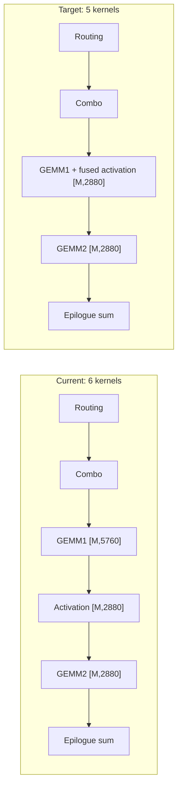
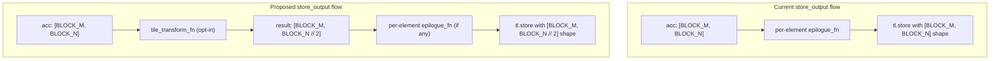

# Tile-Level Epilogue Fusion for Grouped MM Templates

## Problem

The MoE native `grouped_mm` path produces 6 CUDA kernels. The activation kernel (bias + swiglu) between GEMM1 and GEMM2 cannot be fused as a GEMM1 epilogue because swiglu is a **2:1 column reduction** — it takes the `[M, 5760]` accumulator and produces `[M, 2880]` output by pairing adjacent columns. Inductor's epilogue mechanism only supports per-element transforms (same shape in, same shape out).




## Three Blocking Layers

**Layer 1 — Scheduler `can_fuse`** ([torch/_inductor/scheduler.py](torch/_inductor/scheduler.py) line 5520): Already passes. The check only tests mutation/reduction/config, not shapes.

**Layer 2 — Codegen `_split_iteration_ranges`** ([torch/_inductor/codegen/simd.py](torch/_inductor/codegen/simd.py) line 714): The epilogue's iteration space `(11520, 1)` doesn't fit into the template's `(23040, 1)`. Remaining factor of 2 causes `CantSplit`. This is the hard blocker.

**Layer 3 — `store_output` epilogue API** ([torch/_inductor/select_algorithm.py](torch/_inductor/select_algorithm.py) line 1195): The `epilogue_fn` receives one scalar accumulator value via `V.ops`. No way to access adjacent elements. The swiglu needs `acc[row, 2*col]` and `acc[row, 2*col+1]` together.

## Proposed Approach: Tile Transform Hook

Add a `tile_transform` step in `store_output` that operates on the full `[BLOCK_M, BLOCK_N]` accumulator tensor before the per-element epilogue/store. This is lower risk than rewriting the epilogue abstraction since it's an additive opt-in mechanism.




## Implementation Steps

### Step 1: Extend `store_output` with `tile_transform_fn`

In [torch/_inductor/select_algorithm.py](torch/_inductor/select_algorithm.py), `TritonTemplateKernel.store_output()` (line 1195):

- Add an optional `tile_transform_fn` parameter that receives the full accumulator variable name and returns transformed Triton code + new shape
- When present, emit the transform code before the existing per-element epilogue/store logic
- Adjust `output_index` and `mask` to match the transformed output shape
- The existing `epilogue_fn` path remains untouched when `tile_transform_fn` is None

### Step 2: Adjust iteration range mapping for transformed output

In [torch/_inductor/codegen/simd.py](torch/_inductor/codegen/simd.py), `_split_iteration_ranges` (line 714):

- When a tile transform is active, the epilogue nodes' iteration space differs from the template's output. The codegen needs to know the post-transform shape rather than the raw accumulator shape
- Option A: Skip epilogue node codegen entirely when tile_transform already includes the epilogue logic (simpler, less general)
- Option B: Adjust the template's reported output shape to match post-transform (more general, harder)

### Step 3: Pattern detection for swiglu

In [torch/_inductor/kernel/mm_grouped.py](torch/_inductor/kernel/mm_grouped.py):

- Detect when the GEMM1 output feeds into a swiglu pattern: `slice(::2)` + `slice(1::2)` + clamp + sigmoid + mul
- When detected, set `tile_transform_fn` to a swiglu-specific transform and adjust the template's output layout to `[M, N//2]`
- Pass any extra inputs needed by the transform (bias tensor, alpha/limit constants) as suffix args

### Step 4: Template-side tile transform codegen

In [torch/_inductor/kernel/templates/triton_mm_grouped.py.jinja](torch/_inductor/kernel/templates/triton_mm_grouped.py.jinja):

- The template already calls `{{store_output(...)}}` at lines 373-375
- When a tile transform is registered, the generated code would look like:

```
c = accumulator.to(tl.float32)
# Tile transform: swiglu
gate = c[:, ::2]   # [BLOCK_M, BLOCK_N // 2]
up = c[:, 1::2]
gate = tl.minimum(gate, 7.0)
up = tl.maximum(tl.minimum(up, 7.0), -7.0)
c_out = gate * tl.sigmoid(gate * 1.702) * (up + 1.0)
# Now store c_out with half-width indices
{{store_output(("idx_m", "idx_n_half"), "c_out", "mask_half", ...)}}
```

### Step 5: Enable prologue fusion for grouped_mm (bonus)

One-line change in [torch/_inductor/kernel/mm_grouped.py](torch/_inductor/kernel/mm_grouped.py) line 128:

```python
triton_grouped_mm_template = TritonTemplate(
    name="grouped_mm",
    grid=persistent_grouped_mm_grid,
    source=load_kernel_template("triton_mm_grouped"),
    prologue_loads_all_inputs=True,  # <-- add this
)
```

This unblocks prologue fusion for the dtype cast before GEMM2 (separate from the tile epilogue work, but complements it).

## Alternative: Custom MoE Template (simpler, less general)

Instead of extending the general epilogue mechanism, register a `grouped_mm_swiglu` template that hardcodes the GEMM + activation in one kernel. This avoids all the pattern detection complexity.

- New file: `torch/_inductor/kernel/mm_grouped_swiglu.py`
- New template: `torch/_inductor/kernel/templates/triton_mm_grouped_swiglu.py.jinja`
- Register as an autotuning choice when the pattern `grouped_mm -> bias -> swiglu` is detected in the lowering

This is **much simpler** (1 new template, no changes to the fusion infrastructure) but only helps the swiglu case, not other gated activations.

## Risk Assessment

- **Tile transform approach**: Medium-large scope (~300-500 lines across 4 files). Risk of breaking existing epilogue codegen if not carefully guarded behind opt-in checks. The pattern detection is the most error-prone part.
- **Custom template approach**: Small scope (~200 lines, 2 new files). No risk to existing code. But doesn't generalize.
- **Recommendation**: Start with the custom template to validate the performance win, then generalize to the tile transform mechanism if the pattern appears in other models.

